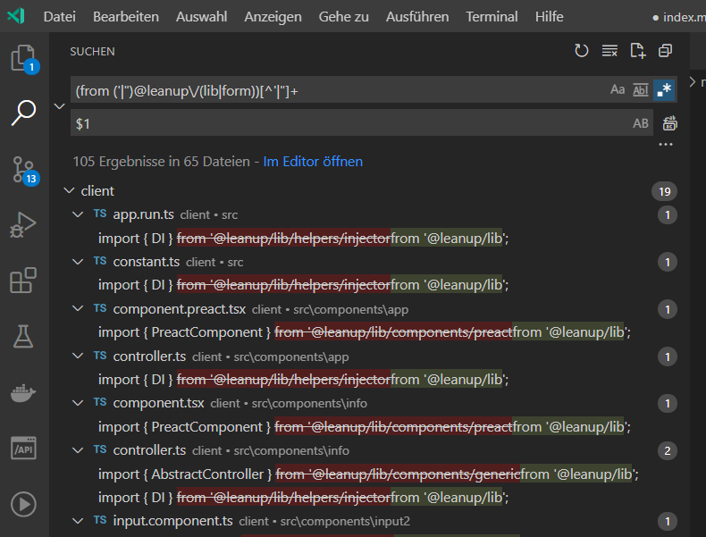

# Migration

The `@leanup stack` is maximally decoupled, so we can proceed quickly and with only tiny changes.

## Migrate from 1.1 to 1.2
1. ✋ The inline css inside the `main.js` will extract in seperate artifact file (`main.css`). (CSP)
2. ✋ Add copy public folder to dist (`copy-webpack-plugin`)
3. ✋ add `"type": "module"` in the `package.json` of your own npm modules (required by `mocha` v9)
4. ✋ add `cjs`, `esm` and `umd` variants in `@leanup/lib` and `@leanup/form`
5. ✋ add a new framework [SolidJS](https://solidjs.com) option (`@leanup/cli-solid` and `@leanup/stack-solid`)

### Changes

1. ⛔ `autoprefixer` dependency was removed from stack, it is to handle in project scope
2. ⛔ `cssnano` dependency was removed from default template, it is to handle in project scope
3. ⛔ `postcss.config.js` file was removed from stack, it is to handle in project scope
4. ⛔ `InfernoComponent`, `PreactComponent` and `ReactComponent` are removed from `@leanup/lib`. use the default `Component` classes from `Inferno`, `Preact` or `React`
5. ⛔ you should replace all import path like `from '@leanup/lib/...';` to `from '@leanup/lib';` and  `from '@leanup/form/...';` to `from '@leanup/form';`<br><br>
Regular expression: `/(from ('|")@leanup\/(lib|form))[^'|"]+/g`<br>
Replacement: $1<br><br>


### Migrate

Follow the steps below to update the stack.

#### Fetch changes

```bash
> git checkout -b chore/update-leanup-stack-to-v1.2
> npm i -D @leanup/cli@^1.2 @leanup/cli-<framework>@^1.2
> npx <framework> create --only-config --no-install --overwrite
```

Available Frameworks: `angular`, `angularjs`, `inferno`, `lit-element`, `preact`, `react`,`svelte`,`vanilla`,`vue` and `vue3`

#### Clearing changes

After the changes have been fetched, the changed files must be reviewed. Some changes can then be corrected again.

#### Install dependencies

Now execute `npm install`.

## Migrate from 1.0 to 1.1

### Changes

1. ✨ Refactoring the @leanup module separation
2. ✨ Maximal Major-Upgrade from all dependencies
3. ✨ Remove some not really important dependencies (e.g. `copy-webpack-plugin`, `html-webpack-plugin`)
4. ✨ Global CLI installation
5. ✨ Webpack 5
6. ✨ ESBuild
7. ✨ Much faster stack installation
8. ✨ Much faster script execution (ESBuild)
9. ⚽ Vite 2 (experimental)
10. ⚽ Snowpack 3 (experimental)
11. ✋ Builds does only contains the SourceCode-Artifacts (no frame material, like public-folder and their assets)
12. ✋ The bundled artifact name (`app.js`) was change to `main.js`.
13. ✋ The separate css artifact file (`app.css`) is now included inside the `main.js`.
14. ✋ The script tag in the `index.html` must now be inserted yourself.
15. ⛔ We can not longer be supported [Aurelia](https://aurelia.io/) as long as the ticket [#39](https://github.com/leanupjs/leanup/issues/39) is not resolved.

### Migrate

Follow the steps below to update the stack.

#### Fetch changes

```bash
> git checkout -b chore/update-leanup-stack-to-v1.1
> npm i -D @leanup/cli@^1.1 @leanup/cli-<framework>@^1.1
> npx <framework> create --only-config --overwrite --no-install
```

Available Frameworks: `angular`, `angularjs`, ~~`aurelia`~~\*, `inferno`, `lit-element`, `preact`, `react`,`svelte`,`vanilla`,`vue` and `vue3`

> <small style="color: #d00">\* Aurelia is not Webpack v5 compatible.</small>

#### Clearing changes

After the changes have been fetched, the changed files must be reviewed. Some changes can then be corrected again.

#### Install dependencies

Now execute `npm install`.

#### Edit you index.html

Add the following script tag in you `index.html` body.

```html{2,3}
    ...
    <script nomodule src="main.js"></script>
    <script type="module" src="main.js"></script>
  <body>
</html>
```

#### If you have unsafe-eval with @babel/runtime

If you have CSP problems with `unsafe-eval` by using @babel/runtime. You can configure this as follows:

1. Extends the `webpack.config.js` like this<br>

```js
module.exports = (...args) => {
  // Here using the example for react
  const config = require('@leanup/stack-react/webpack.config')(...args);

  config.module.rules.unshift({
    test: /runtime.js$/,
    loader: 'string-replace-loader',
    options: {
      search: /[^\w]Function\(/,
      replace: '// Function(',
    },
  });

  return config;
};
```

#### If you need the frame material

If you need the frame material from the public folder in your dist folder. You can configure this as follows:

1. Install `npm i -D copy-webpack-plugin`
2. Extends the `webpack.config.js` like this<br>

```js
module.exports = (...args) => {
  // Here using the example for react
  const config = require('@leanup/stack-react/webpack.config')(...args);

  const CopyPlugin = require('copy-webpack-plugin');
  if (args[0].WEBPACK_BUILD) {
    config.plugins.push(
      new CopyPlugin({
        patterns: [
          {
            from: 'public',
          },
        ],
      })
    );
  }

  return config;
};
```
